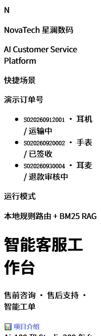
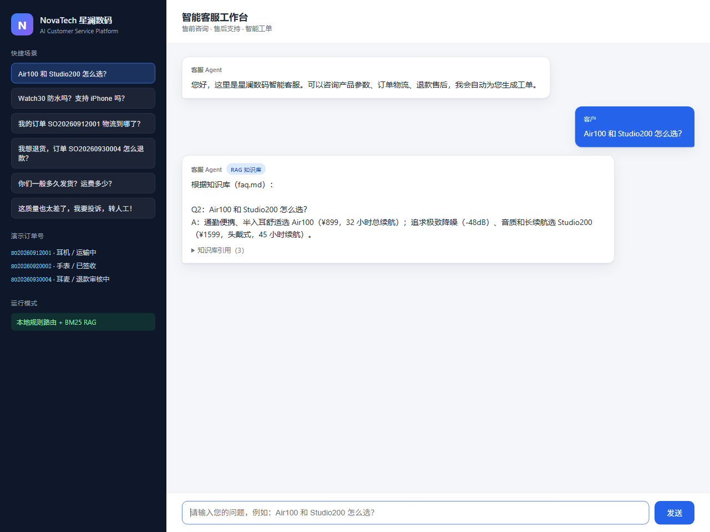
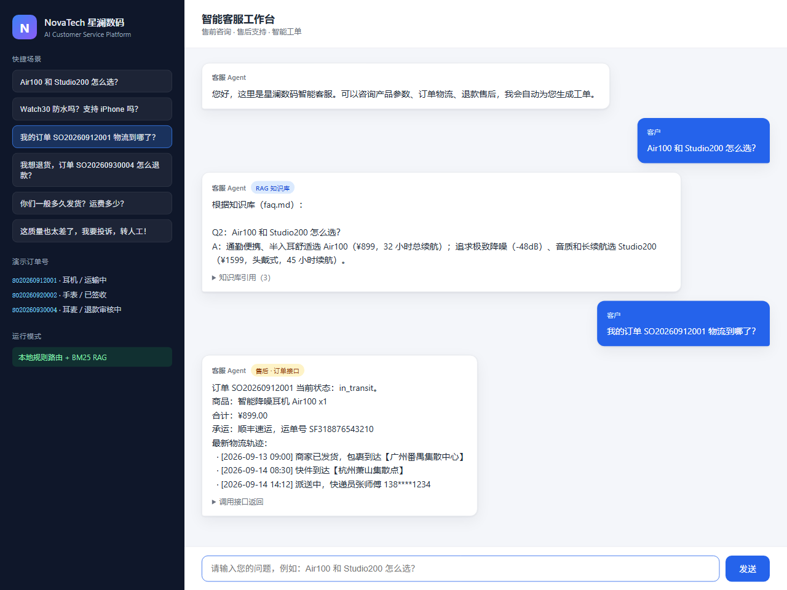
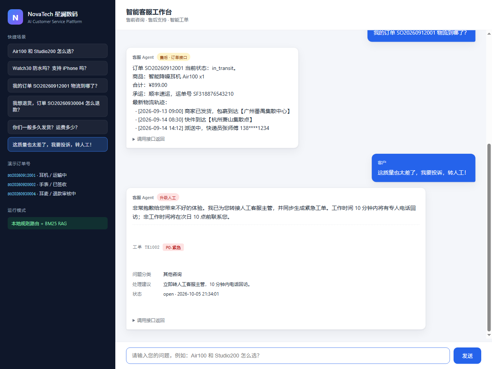
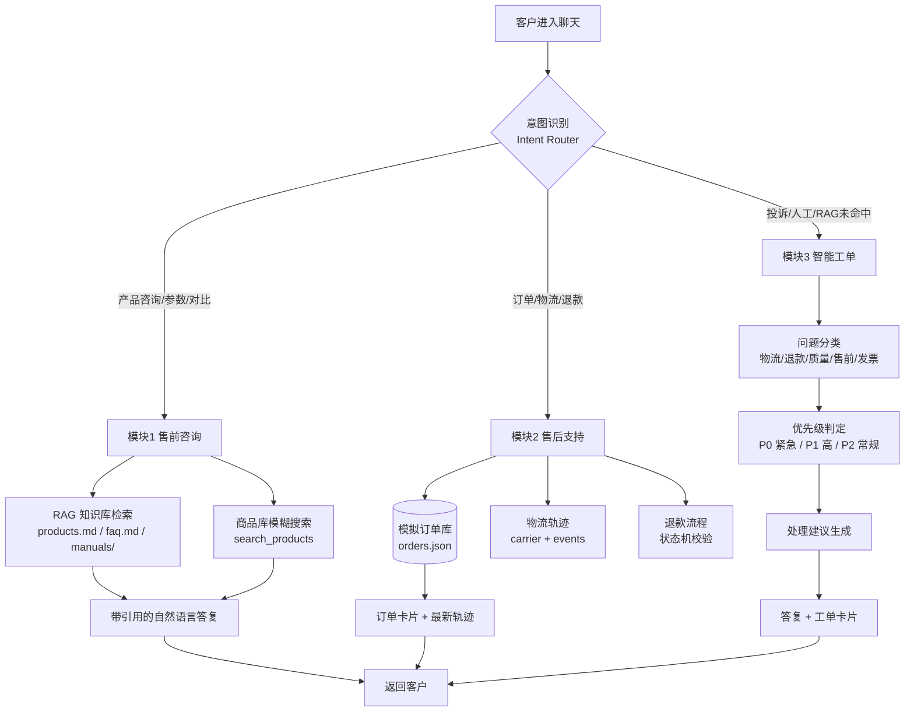
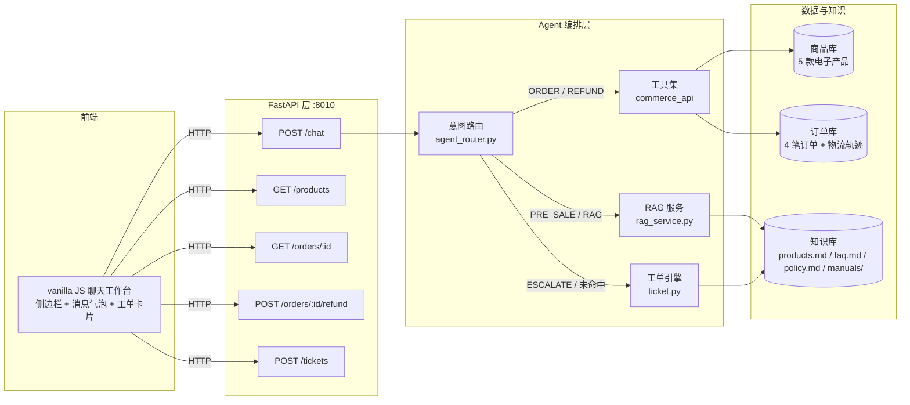
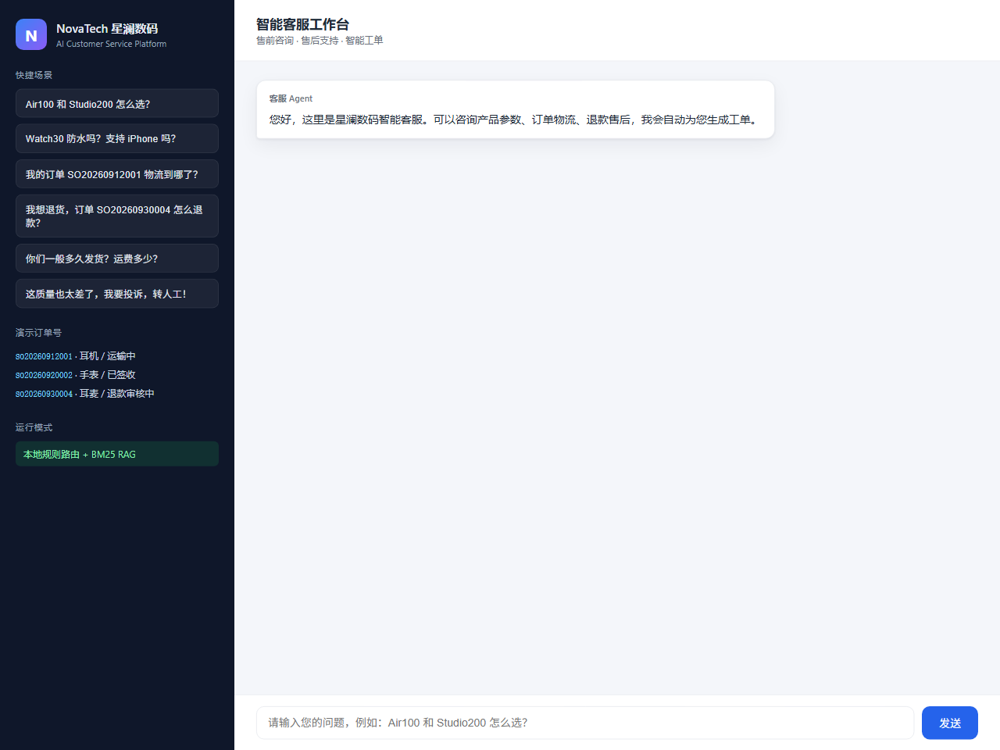

# AI Customer Service Platform

> 企业级电商智能客服 Agent・基于 RAG + Function Calling + Workflow 编排
> 改造自开源项目
>
> [lingyun1010/ecommerce-rag-agent](https://github.com/lingyun1010/ecommerce-rag-agent)
>
> ，模拟一家销售消费电子的企业「星澜数码 NovaTech」的真实客服系统。

[]()
[]()
[]()
[]()

**国产模型一键切换**：`MODEL_PROVIDER=deepseek|qwen|zhipu|kimi|openai`，默认 `local` 本地 BM25 零外部依赖。
国内部署详见 [README_CN.md](./README_CN.md)。

## 在线体验

启动后两个页面：

| 页面 | 地址 | 作用 |
|---|---|---|
| 📊 **项目介绍页** | `/showcase` | 作品集展示：架构、能力、场景、一键启动 |
| 💬 **客服工作台** | `/` | 实际功能演示：售前 / 售后 / 工单全流程 |







***

## 业务定位

一家销售消费电子（耳机 / 手表 / 键盘 / 充电器）的直营电商，客服需要同时覆盖：


| 场景       | 客户问题              | 系统处理方式                       |
| -------- | ----------------- | ---------------------------- |
| **售前咨询** | 产品参数、型号对比、配件、使用场景 | RAG 检索产品手册 + FAQ，命中商品时附带商品卡片 |
| **售后支持** | 订单状态、物流轨迹、退款流程    | 调用模拟订单 / 物流 / 退款业务接口         |
| **智能工单** | 投诉、升级人工、RAG 未命中   | 自动生成问题分类 / 优先级 / 处理建议        |


***

## 业务流程图





***

## 系统架构图





***

## 技术栈


| 层            | 技术                                | 说明                                                                                                           |
| ------------ | --------------------------------- | ------------------------------------------------------------------------------------------------------------ |
| **Agent**    | 规则路由 + LLM Function Calling 双路 | `llm_provider.py` 统一适配 OpenAI / DeepSeek / 通义 / 智谱 / Kimi；无 Key 时走规则兜底 |
| **RAG**      | LlamaIndex（生产）/ 自研 BM25（演示）       | 语料为产品手册 + FAQ + 售后政策；中文按 bigram 分词                                                                           |
| **API**      | FastAPI + Uvicorn                 | RESTful 接口，CORS 开放前端域                                                                                        |
| **Workflow** | 状态机路由                             | `PRE_SALE → RAG` / `ORDER_STATUS → commerce_api` / `REFUND → refund_state_machine` / `ESCALATE → ticket(P0)` |
| **前端**       | 原生 HTML/CSS/JS                    | 无框架，侧边栏工作台布局                                                                                                 |
| **数据**       | 纯 Python dataclass 模拟             | 商品库 / 订单库 / 物流轨迹 / 退款状态全部内存化                                                                                 |


***

## 目录结构


```
ecommerce-rag-agent/
├── api.py                # FastAPI 入口：/chat /products /orders /refund /tickets
├── agent_router.py       # 意图路由 + Agent 编排（保留原文件，扩展中文意图）
├── openai_tool_router.py # OpenAI tool calling 路由（生产路径）
├── rag_service.py        # RAG 服务：LlamaIndex 生产路径 + BM25 本地兜底
├── commerce_api.py       # 模拟商品库 + 订单库 + 物流 + 退款（已替换为电子产品）
├── ticket.py             # 新增：智能工单（分类/优先级/处理建议）
├── store_knowledge.py    # 保留：URL → Markdown 知识抽取工具
├── app.py                # 保留：CLI REPL
├── data/
│   ├── products.md       # 产品手册语料
│   ├── faq.md            # 客服 FAQ
│   ├── policy.md         # 售后政策（7天无理由/退款/保修）
│   └── manuals/
│       └── air100_manual.md  # 单品使用手册
├── frontend/             # 聊天工作台 UI
└── docs/screenshots/     # 运行截图
```


***

## 快速启动

### 方式 A：本地一键启动（推荐）

```bash
pip install -r requirements.txt -i https://mirrors.aliyun.com/pypi/simple/
uvicorn api:app --host 0.0.0.0 --port 8010
```

浏览器直接打开 **http://localhost:8010** ，前后端一体。

> 默认 `MODEL_PROVIDER=local`，走规则路由 + BM25 RAG，零外网依赖。
> 想接国产大模型，复制 `.env.example` 为 `.env`，填一个 `DEEPSEEK_API_KEY`（或通义/智谱/Kimi）即可，详见 [README_CN.md](./README_CN.md)。

### 方式 B：Docker 启动

```bash
docker compose up -d --build
```

访问 http://localhost:8010 。

### 方式 C：开发模式（前后端分离）

```bash
uvicorn api:app --port 8010 --reload
cd frontend && python -m http.server 5173
```

访问 http://localhost:5173 。


***

## 演示场景


| 你问                          | 路由             | 看到什么                   |
| --------------------------- | -------------- | ---------------------- |
| Air100 和 Studio200 怎么选？     | `RAG`          | faq.md 答案 + 3 条知识库引用   |
| Watch30 防水吗？支持 iPhone 吗？    | `PRE_SALE`     | products.md 参数 + 商品卡片  |
| 我的订单 SO20260912001 物流到哪了？   | `ORDER_STATUS` | 订单状态 + 顺丰单号 + 3 条轨迹    |
| 我想退货，订单 SO20260930004 怎么退款？ | `REFUND`       | 退款受理 / 已在审核中等状态机校验     |
| 你们一般多久发货？运费多少？              | `RAG`          | faq.md 物流政策答案          |
| 这质量也太差了，我要投诉，转人工！           | `ESCALATE`     | 人工升级文案 + **P0 紧急工单卡片** |


***

## 核心 API


```
# 健康检查
curl http://127.0.0.1:8010/health

# 商品库
curl http://127.0.0.1:8010/products

# 订单详情（含物流轨迹 + 退款状态）
curl http://127.0.0.1:8010/orders/SO20260912001

# 提交退款
curl -X POST http://127.0.0.1:8010/orders/SO20260930004/refund \
  -H "Content-Type: application/json" \
  -d '{"reason":"不想要了"}'

# 聊天
curl -X POST http://127.0.0.1:8010/chat \
  -H "Content-Type: application/json" \
  -d '{"message":"Air100 和 Studio200 怎么选？"}'

# 手动建工单
curl -X POST http://127.0.0.1:8010/tickets \
  -H "Content-Type: application/json" \
  -d '{"message":"耳机连不上蓝牙","order_id":"SO20260912001"}'
```


***

## 运行截图


| 初始工作台                                            | 售前 RAG 答复                                       |
| ------------------------------------------------ | ----------------------------------------------- |
|  |  |


| 订单物流卡片                                            | 智能工单（P0 升级）                                          |
| ------------------------------------------------- | ---------------------------------------------------- |
|  |  |


***

## 设计取舍：为什么 API + RAG + Agent 要拆开


* **精确业务数据走 API**：订单状态、物流轨迹、退款金额、库存、价格 —— 这些是动态、强一致的事实，必须从业务库读，不能让 LLM 编。

* **解释性知识走 RAG**：产品手册、FAQ、售后政策 —— 这些是文本，会更新，需要带引用可追溯。

* **路由走 Agent**：同一句话「我想退钱」可能是售前问政策、也可能是售后真要退某单，Agent 根据是否带订单号、是否有情绪词来决定走哪条路。

* **不确定的问题自动转工单**：RAG 没命中 / 用户提投诉 / 情绪激烈，立即生成结构化工单交给人。

这就是一个最小可用、但流程完整的企业客服自动化闭环。


***

## Credits


* 基础架构：[lingyun1010/ecommerce-rag-agent](https://github.com/lingyun1010/ecommerce-rag-agent)

* RAG 框架：[LlamaIndex](https://github.com/run-llama/llama_index)

* Web 框架：[FastAPI](https://fastapi.tiangolo.com/)